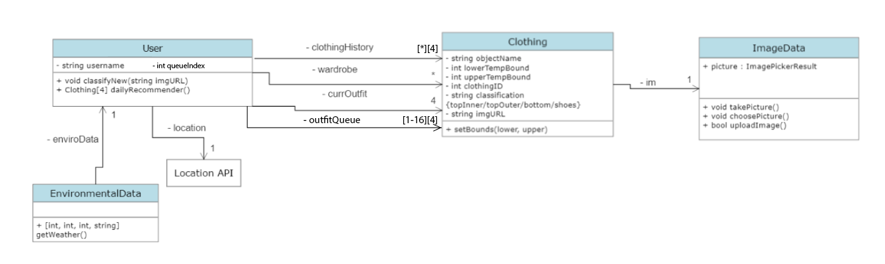

# Outfit-Forecast

An app to generate outfit predictions based on one's wardrobe and current weather.

Current class diagram

<ins>Test suite used:</ins> unittest (https://docs.python.org/3/library/unittest.html)

<ins>Directory Structure:<ins>

For milestones 4a and 4b, our new code will be in the directory 4ab

<ins>How to compile:</ins> No need to compile!

<ins>How to run code:</ins>

python3 4ab/backend_functions.py

<ins>How to run the unit test cases:</ins>

run 'make setup' to download the requirements needed

run 'make tests' to run tests

<ins>Plan for 2nd iteration (backend only):<ins>

- Implement prevention of outfit repetition --> dailyRecommender() will look at a few recent outfits in clothingHistory list and make sure not to output them
- Allowing user to accept/decline an outfit --> if the user has rejected an outfit, dailyRecommender will rerun and create a new outfit to output (rejections will be reset every time dailyRecommender() is called for the first time in a day / not after a rejected outfit [this will be managed by the front-end depending on how they call the Flask API])
- Improve classifyNew() --> improve the way classifyNew() classifies images, including using object detection in addition to label detection. Object detection will be used for classification (it seems to have less margin of error in classifying correctly), and label detection is more specific so it will be used for the objectName

<ins>What we are not implementing and why:<ins>

"Stop making suggestions that user has denied for certain weather" --> Originally our plan was if a user rejects an outfit on a certain weather, in the future when that weather comes up again, we would weigh that outfit less (the probability of recommending that outfit is lower than other outfits). We decided not to implement this because if a user declines an outfit, it could be because of multiple reasons not due to the weather (they didn't feel like wearing that outfit that day, etc).

<ins>Work division:<ins>

Gautam and Perene: improving classifyNew(), work with frontend to make sure endpoints are being called correctly, writing tests for classifyNew(), dailyRecommender(), and getter and setter for new rejected list

Leo and Daniel: modifying Flask endpoints to implement new outfit rejection feature (and writing Flask tests), restructuring MongoDB database out of testing phase, improving dailyRecommender() by...
- implementing clothing history to prevent yesterday's accepted outfit from being recommended
- implementing ability to reject outfits and re-call function to get another outfit
- internally selecting 2 'best outfits' with no overlap and then outputting combinations of them as rejections come through

<ins>Milestone 4B Implementation Comments:<ins>

classifyNew endpoint:
- We decided to use a POST method rather than a GET method because passing the image url through the endpoint url was not feasible

classifyNew function has been improved:
- Decided not to use label_detection at all and instead we are relying solely on  object detection, as this is far more accurate and reliable
- With more testing of images with Google Vision's label_detection feature, we found that it classified clothes very inaccurately
- Object Detetction feature, although producing slighly broad/vague labels, is far more accurate, and so is used to help with determining classification and name of clothing object
  
dailyRecommender function has been improved as stated in the specs above

