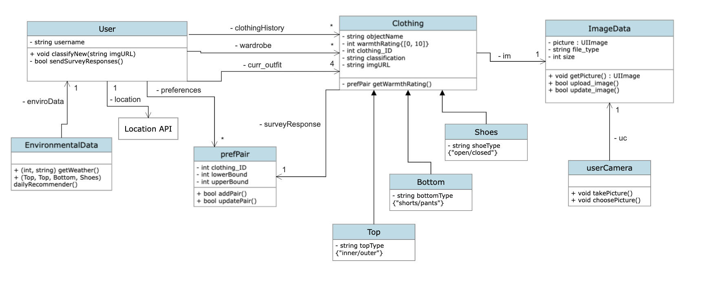

# Outfit-Forecast

An app to generate outfit predictions based on one's wardrobe and current weather.

Current class diagram

<ins>Test suite used:</ins> unittest (https://docs.python.org/3/library/unittest.html)

<ins>Testing file:</ins> backend_functions_tests.py

<ins>Test changes for Milestone 3.b:</ins>
- Removed all tests for EnvironmentalData class because that is being handled by the front-end
- Moved dailyRecommender function back to User class because we believe that it is certainly part of the core user functionality (even though we were suggested to move it elsewhere)
- test_username for User class has some changes due to changing parameters of what is allowed. 
  Old parameters: length at most 32, cannot be empty, alphanmeric but must have at least one letter and one digit, no special characters, first char cannot be a digit
  New parameters: length at most 32, cannot be empty, alphanumeric but must have at least one letter, no special characters, no whitespaces, first char cannot be a digit
- TestClothing class had constructor changed to also take in classification as an input.
- test_classification for Clothing class had tests simplified to only allow top/bottom/shoes as possible classifications
